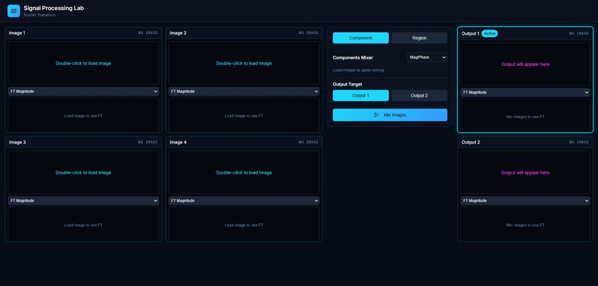
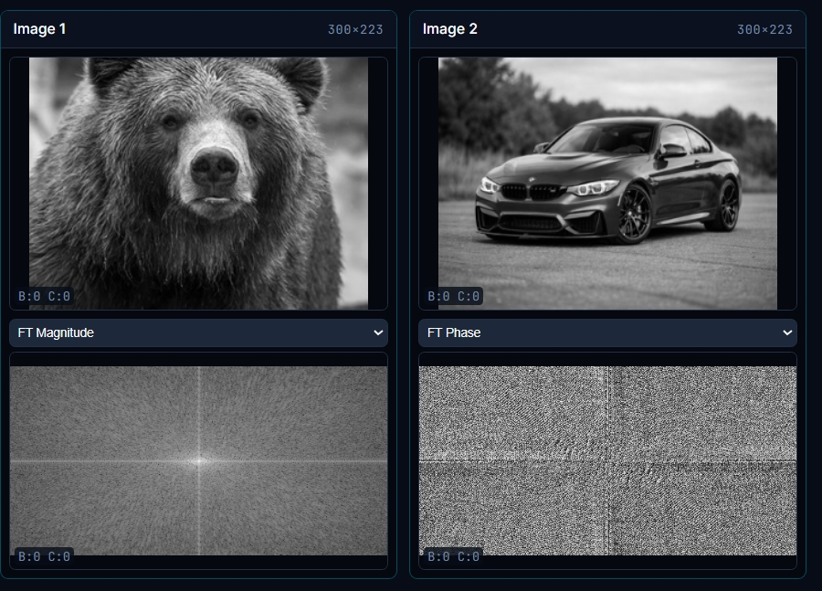
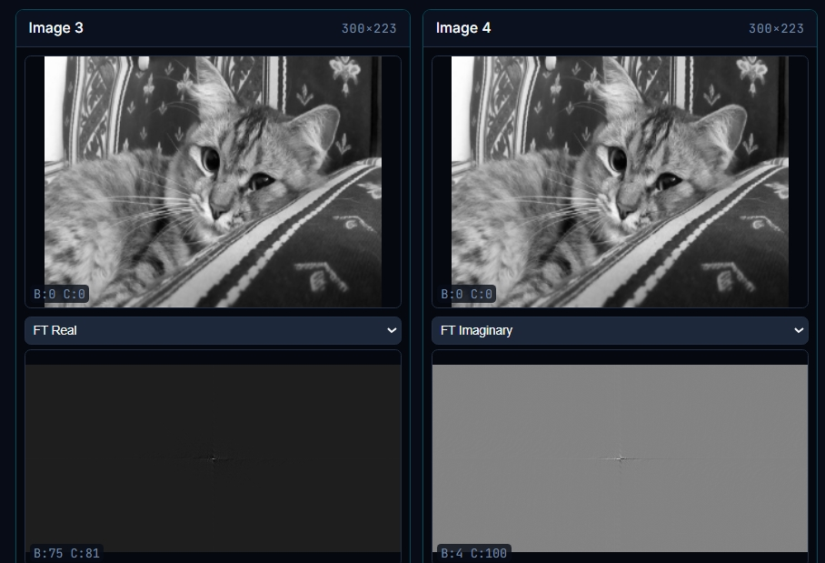
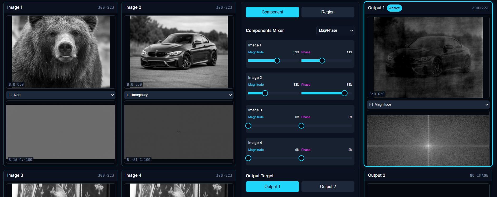
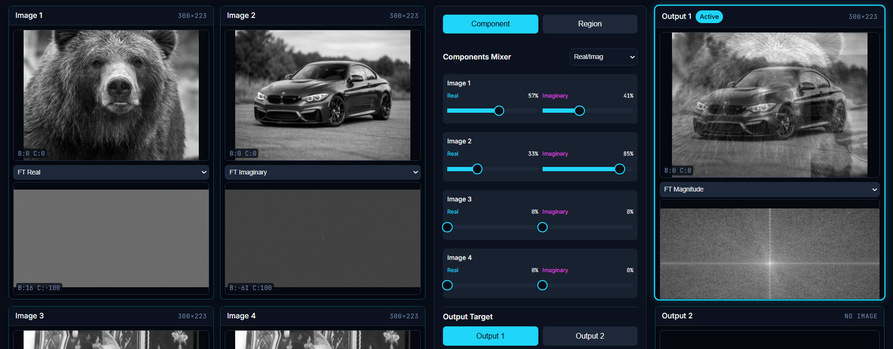
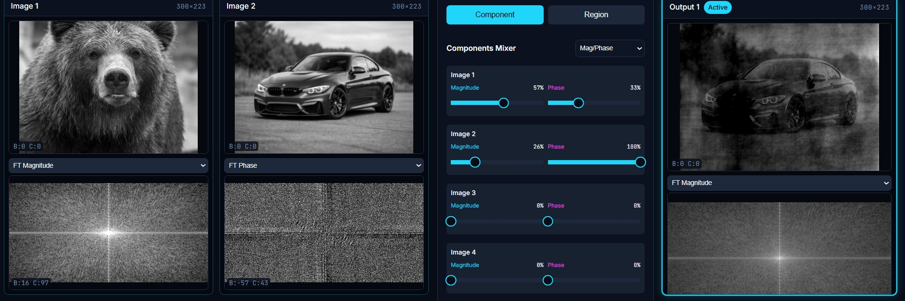
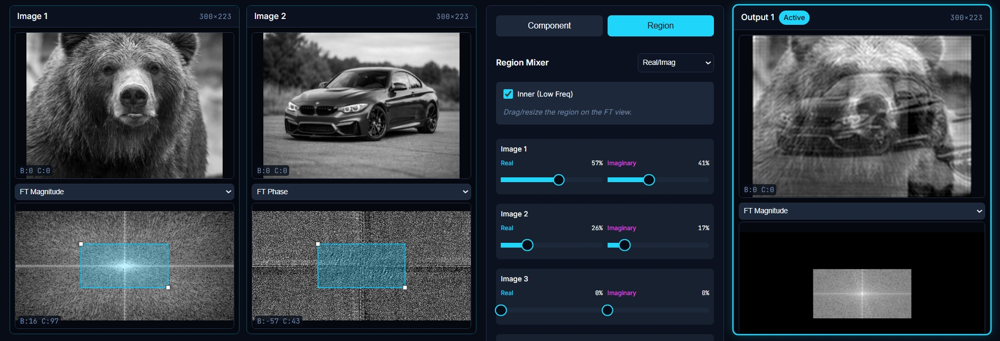
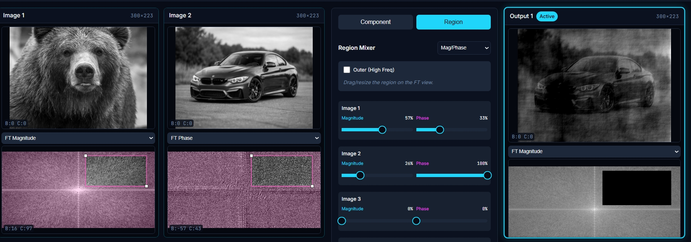

# SpectraMix — Interactive Multi-Image Frequency Mixer


FT-Mixter is a modern, interactive platform for visualizing and mixing multiple images in the frequency domain. \
Upload images, inspect magnitude/phase (or real/imaginary) components, mix across multiple inputs, and preview the result across viewports in real time.

[](#)
[](#)
[](#)

## Demo


## Screenshot Gallery

### Core Interface

The main workspace allows for simultaneous management of 4 source images and 2 independent output targets.



---

### Frequency Domain Analysis

Unlike standard editors, this tool allows you to visualize and interact with the **2D Fourier components** of any image.

- **Spatial Domain:** The original grayscale representation of the image.
- **Magnitude Spectrum:** Visualizes the strength of frequencies (shapes/patterns).
- **Phase Spectrum:** Visualizes the spatial location of frequencies (edges/structure).  
   
- **Real & Imaginary Components:** The raw complex components of the 2D FFT.  
   

### Modes & Controls

Interactive features and workflow logic for advanced **2D Frequency Domain** processing.

---

#### Mathematical Mixing Modes (Swap Toggle)

Users can switch between two fundamental mathematical representations for frequency-domain image mixing:

- **Magnitude / Phase Mode**  
  Ideal for exchanging **structural information** (Phase) with **energy and texture** (Magnitude).

- **Real / Imaginary Mode**  
  Enables direct linear combination of the **raw complex-valued FFT components**, offering precise control over frequency reconstruction.




> **tip:** Phase information dominates spatial structure. Swapping phase often changes _where_ features appear more dramatically than swapping magnitude changes _how strong_ they appear.

---

#### Mixer Mode Selection (Component vs. Region)

Choose between global frequency mixing or localized spectrum manipulation:

- **Component Mode**  
  Applies weighted mixing across the entire frequency domain for all loaded images.

- **Region Mode**  
  Activates an interactive bounding box on the frequency canvas to modify only a selected subset of frequencies.




> **tip:** Use _Component Mode_ for holistic blending, and _Region Mode_ when you want surgical control over specific frequency bands.

---

#### Interactive Frequency Region (Low-Pass / High-Pass)

Manipulate frequency content directly on the FFT canvas using a draggable and resizable selection box:

- **Inner (Low-Pass)**  
  Preserves central low frequencies, resulting in smoothing and blurring effects.

- **Outer (High-Pass)**  
  Preserves higher frequencies, enhancing edges and fine details.




> **tip:** A smaller low-pass region produces stronger blurring, while a tighter high-pass ring isolates edges more aggressively.

---

#### Mouse-Gesture Brightness & Contrast

Real-time visualization adjustments across both spatial and frequency domains using intuitive mouse gestures:

- **Vertical Drag:** Adjusts brightness (up to increase, down to decrease).
- **Horizontal Drag:** Adjusts contrast (right to increase, left to decrease).


> **tip:** Adjust brightness and contrast **after** frequency manipulation to better inspect subtle spectral changes.

---

#### Smart Unified Resizing

The system automatically detects the **smallest spatial resolution** among all loaded images and resizes the processing workspace accordingly, ensuring exact alignment between spatial pixels and frequency bins.

> **tip:** This guarantees mathematically valid FFT mixing and prevents artifacts caused by mismatched dimensions.

---

#### Dual-Output Orchestration

Select **Output 1** or **Output 2** as the reconstruction target to compare different mixing or filtering strategies side-by-side.

> **Pro tip:** Route low-pass results to one output and high-pass results to the other to visually analyze structure vs. detail.

---

#### 4-Domain Analysis Selection

Each viewport includes a dedicated dropdown to switch the frequency representation between:

- **Magnitude**
- **Phase**
- **Real**
- **Imaginary**

> **tip:** Toggle between domains while keeping the same region selected to understand how each representation contributes to the final image.

Interactive features and workflow logic for advanced 2D Frequency Domain processing:

- **Mixer Mode Selection (Component vs. Region)** — Switch between global mathematical mixing and selective frequency filtering.
  - **Component Mode:** Standard weighted mixing of full frequency arrays (e.g., Magnitude from Image 1 + Phase from Image 2).
  - **Region Mode:** Enables an interactive bounding box on the frequency canvas for localized spectrum manipulation.
- **Interactive Frequency Region (Low-Pass / High-Pass)** — Users can visually "carve" the frequency spectrum using a draggable and resizable selection box directly on the FFT canvas.
  - **Inner (Low-Pass):** Preserves the central low frequencies to retain general shapes while removing fine details (blurring).
  - **Outer (High-Pass):** Removes the DC component and low frequencies to highlight edges, textures, and fine structures.
- **Mouse-Gesture Brightness & Contrast** — Real-time visibility control across both spatial and frequency domains using intuitive mouse movements.
  - **Vertical Drag:** Adjusts Brightness (Up to increase, Down to decrease).
  - **Horizontal Drag:** Adjusts Contrast (Right to increase, Left to decrease).
- **Smart Unified Resizing** — To ensure mathematical compatibility across different source images, the engine automatically identifies the **smallest image area** among all loaded inputs and dynamically resizes the workspace to match, preventing pixel-stretching artifacts during the transform.
- **Dual-Output Orchestration** — Select between **Output 1** or **Output 2** as the target for reconstruction. This allows for side-by-side comparison of different filtering strategies or component combinations.
- **4-Domain Analysis Selection** — A dedicated dropdown for each viewport allows users to toggle the frequency representation between **Magnitude, Phase, Real, and Imaginary** components.
- **Workspace Management** — Standard controls for resetting all weights to default, clearing regions, and double-clicking viewports to quickly replace source images.

---

---

## Quick Pitch — Meet SpectraMix

**SpectraMix** is an interactive, browser-based **signal and image frequency-domain lab** built for **education, research, and creative experimentation**.  
It provides a hands-on environment to explore, visualize, and manipulate spectral representations with precision and clarity.

### It includes:

- **2D & 1D Frequency-Domain Processing**  
  Work directly with FFT-based representations to understand and control how signals and images behave across frequency space.

- **Multi-Domain Analysis Views**  
  Instantly switch between **spatial / time domain**, **FFT magnitude**, **phase**, **real**, and **imaginary** components.  
  For 1D signals, toggle between **linear** and **log-frequency (audiogram-style)** views for accurate analysis.

- **Interactive Spectral Mixing & Filtering**  
  Blend, swap, or isolate frequency components using intuitive controls, enabling both global mixing and localized spectral manipulation.

- **Real-Time Visual Feedback**  
  Every interaction updates instantly, making SpectraMix ideal for demonstrations, experimentation, and deep conceptual understanding.

- **Lightweight Project Persistence**  
  Save and reload experiments using a clean JSON format that captures domain views, mixing parameters, and reconstruction settings for easy sharing and reproducibility.

---

> **tip:** SpectraMix shines when used as a _visual intuition builder_—experiment with phase, magnitude, and localized frequency regions to see which components truly define structure.

## Use Cases

- **DSP Students & Educators**  
  Build strong intuition by visualizing and interacting with frequency-domain representations. Explore FFT magnitude, phase, real, and imaginary components, experiment with filtering, and observe how spectral changes affect reconstruction in real time.

- **Signal Processing & Imaging Researchers**  
  Prototype and analyze frequency-domain techniques, compare mixing strategies, and study the impact of localized spectral manipulation on both 1D signals and 2D images.

- **Creative Technologists & Experimental Artists**  
  Use SpectraMix as a playground for spectral blending, texture transfer, and structural remixing, enabling novel visual and auditory effects driven by frequency content.

- **Engineers & Practitioners**  
  Inspect signals and images spectrally, debug artifacts, and validate processing pipelines using precise visual feedback across multiple domains.

---

> **tip:** SpectraMix is especially powerful when used comparatively—route different strategies to separate outputs to clearly see how each frequency-domain decision changes the result.

# Table of Contents

- [Installation](#installation)
- [Quick Start](#quick-start)
- [Features](#features)
- [Development & Contributing](#development--contributing)
- [Contact & Acknowledgements](#contact--acknowledgements)

---

# Installation

## Prerequisites

- **Node.js** (v16+ recommended)
- **npm** (bundled with Node.js)

---

## Setup

Install project dependencies from the root directory:

```powershell
cd "SpectraMix"
npm install
```

## Quick Start

1. Open the app in your browser.

2. Upload your images directly

3. Select a mixing mode:

   - **Magnitude / Phase**
   - **Real / Imaginary**

4. Adjust:

   - Region selection
   - Frequency filters

   to experiment with image mixing.

5. Preview results in real-time using the built-in **FFT** and **spatial viewers**.

6. Export your mixed images for download or further processing.

**tip:**  
Experiment with swapping **phase** or **real/imaginary** components to explore how structure and texture interact. Use **region-based mixing** for precise, local edits.
